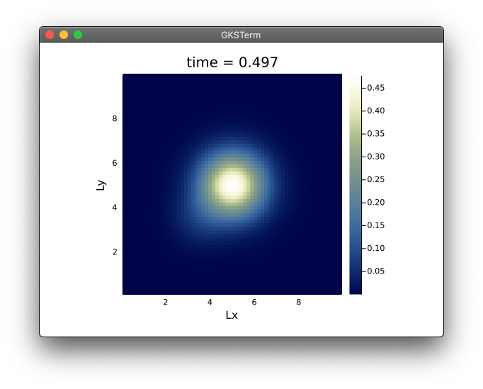

# PT diffusion - MWE
Simple multi-xPU diffusion solvers to showcase itertive accelerated solvers.



This repository contains a set of 2D explicit and iterative implicit diffusion solvers to run on xPU (CPU or GPU) using [ParallelStencil.jl](https://github.com/omlins/ParallelStencil.jl); the multi-xPU version uses [ImplicitGlobalGrid.jl](https://github.com/eth-cscs/ImplicitGlobalGrid.jl).

The scripts in this repo solve the time-dependent diffusion equation with variable coefficient:
```
qT        = -λ ∇ T
ρCp dT/dt = -∇ ⋅ qT
```
using an explicit approach ([`diffusion_2D_expl_xpu.jl`](diffusion_2D_expl_xpu.jl)) or an iterative implicit approach ([`diffusion_2D_impl_xpu.jl`](diffusion_2D_impl_xpu.jl)) based on the pseudo-transient acceleration.

The multi-xPU code ([`diffusion_2D_expl_mxpu.jl`](diffusion_2D_expl_mxpu.jl)) allows to run the explicit diffusion example on multiple CPUs and GPUs using distributed memory parallelisation.

Further information on the accelerated pseudo-transient method can be found in the [Räss et al. 2022 GMD discussion paper](https://gmd.copernicus.org/preprints/gmd-2021-411/), extending the original idea from [Frankel (1950)](https://doi.org/10.2307/2002770).

Other usefull resources can be found here:
- https://github.com/PTsolvers/PseudoTransientDiffusion.jl
- https://pde-on-gpu.vaw.ethz.ch/lecture4/
